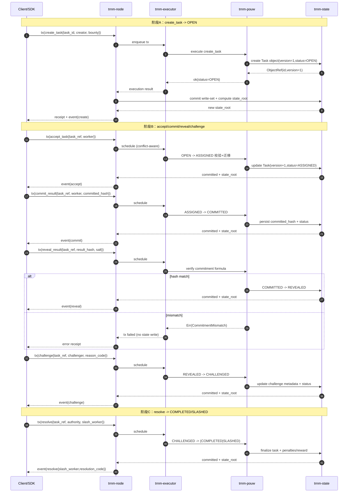

# Rust L1 PoUW 模块交互时序（create → resolve）

状态：Draft  
日期：2026-02-20  
适用范围：`trillionnium-rust`（`trnm-node` / `trnm-executor` / `trnm-pouw` / `trnm-state`）

## 1) 模块职责（简版）

- `trnm-node`：接收交易、推进区块、输出审计事件。
- `trnm-executor`：交易分组并发执行（冲突检测 + 调度）。
- `trnm-pouw`：执行 PoUW 状态机与业务校验。
- `trnm-state`：维护 versioned object store，并计算 `state_root()`。

---

## 2) 端到端时序图（Mermaid）

---

## 3) 关键一致性点（对齐 v1 freeze）

1. **状态迁移唯一性**：仅允许
   `OPEN → ASSIGNED → COMMITTED → REVEALED → CHALLENGED → COMPLETED/SLASHED`。
2. **错误语义稳定映射**：例如 `InvalidTransition / VersionConflict / CommitmentMismatch`。
3. **事件审计字段最小集**：
   `event_type, task_id, from_status, to_status, actor, tx_id, block_height, state_root, ts_unix_ms`；
   resolve 额外 `slash_worker, resolution_code`。
4. **并发不破语义**：执行器策略可变，但不得改变上述协议可观察行为。

---

## 4) 工程落地检查清单

- [ ] `cargo test --workspace` 全绿
- [ ] 并行路径 sanity（含 apply_error/rollback）全绿
- [ ] 事件字段冻结检查脚本全绿（`scripts/check_event_fields.sh`）
- [ ] classic + mixed bench 回归通过且无一致性回退

---

## 5) 备注

- 本文是“讲解与评审视图”，协议冻结准绳仍以：
  `docs/protocol/rust-l1-v1-interface-freeze.md` 为准。
- 后续如引入多节点执行/共识细节，可在本文补充 `cross-node state_root reconciliation` 时序图。
